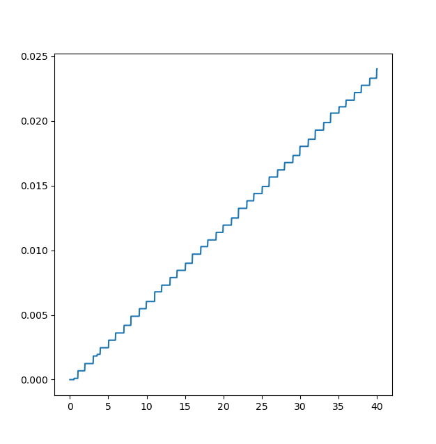
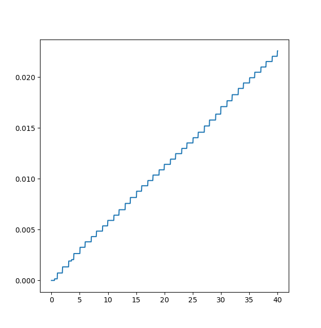

<div dir='rtl'>

# تمرین دوم درس مدار‌های دیجیتال کم‌توان - پیاده‌سازی و آزمون روش LWC

مهدی بهرامیان - ۴۰۱۱۷۱۵۹۳

## نحوه پیاده‌سازی

برای پیاده‌سازی
این سامانه ها به ۷ ماژول نیاز دارد :

- RNG برای اینکه داده‌های آزمایشیمان را تولید کنیم.
- LWCEncoder و LWCDecoder
  برای اینکه داده معمول ۸ بیتیمان را به داده کد شده بر حسب LWC تبدیل و بازیابی کند.
  SerialSender و SerialRecv
  برای اینکه داده‌مان
  را از حالت موازی به حالت سریال تبدیل کنیم و بالعکس.
- TSEncoder و TSDecoder
  برای اینکه داده‌ها را
  بین دو حالت سیگنالینگ سطحی و تفاضلی تبدیل کند.

  همینطور به ۴ ماژول سطح بالا نیاز داریم که به عنوان قطعات اصلی ما عمل کند و در نقش فرستنده
  و گیرنده رفتار کنند :

- SenderNormal و RecvNormal برای آزمون حالت بدون LWC.
- SenderLWC و RecvLWC برای آزمون الگوریتم LWC.

</div>

### RNG:

```verilog
module RNG (
    input clk,
    input rst,
    output reg [7:0] rnd
);
    always @(posedge clk) begin
        if (rst) rnd <= 8'b10101010;
        else begin
            rnd[7:1] <= rnd[6:0];
            rnd[0]   <= rnd[3] ^ rnd[4] ^ rnd[5] ^ rnd[7];
        end
    end
endmodule
```

<div dir='rtl'>
    این ماژول یک
    PRS8Generator
    است که ساختار آن در لینک زیر آمده است :

[PRS8Generator](https://www.isotel.eu/mixedsim/intro/prssine.html#prs8-generator-in-verilog)

</div>

### LWCEncoder

```verilog
module LWCEncoder (
    input clk,
    input rst,
    input [7:0] in,
    output logic [9:0] out
);
    always_comb begin
        case (in[3:0])
            0: out[4:0] = 5'b00000;
            1: out[4:0] = 5'b00001;
            2: out[4:0] = 5'b00010;
            3: out[4:0] = 5'b00011;
            4: out[4:0] = 5'b00100;
            5: out[4:0] = 5'b00101;
            6: out[4:0] = 5'b00110;
            7: out[4:0] = 5'b01000;
            8: out[4:0] = 5'b01001;
            9: out[4:0] = 5'b01010;
            10: out[4:0] = 5'b01100;
            11: out[4:0] = 5'b10000;
            12: out[4:0] = 5'b10001;
            13: out[4:0] = 5'b10010;
            14: out[4:0] = 5'b10100;
            15: out[4:0] = 5'b11000;
            default;
        endcase
        case (in[7:4])
            0: out[9:5] = 5'b00000;
            1: out[9:5] = 5'b00001;
            2: out[9:5] = 5'b00010;
            3: out[9:5] = 5'b00011;
            4: out[9:5] = 5'b00100;
            5: out[9:5] = 5'b00101;
            6: out[9:5] = 5'b00110;
            7: out[9:5] = 5'b01000;
            8: out[9:5] = 5'b01001;
            9: out[9:5] = 5'b01010;
            10: out[9:5] = 5'b01100;
            11: out[9:5] = 5'b10000;
            12: out[9:5] = 5'b10001;
            13: out[9:5] = 5'b10010;
            14: out[9:5] = 5'b10100;
            15: out[9:5] = 5'b11000;
            default;
        endcase
    end
endmodule

```

<div dir='rtl'>
    این ماژول صرفا از ادغام ۲ کد کننده LWC
    ۵ بیتی با حداکثر ۲ بیت۱ تشکیل شده است.
</div>

### LWCDecoder

```verilog
module LWCDecoder (
    input clk,
    input rst,
    input [9:0] in,
    output logic [7:0] out
);

    always_comb begin
        case (in[4:0])
            5'b00000: out[3:0] = 0;
            5'b00001: out[3:0] = 1;
            5'b00010: out[3:0] = 2;
            5'b00011: out[3:0] = 3;
            5'b00100: out[3:0] = 4;
            5'b00101: out[3:0] = 5;
            5'b00110: out[3:0] = 6;
            5'b01000: out[3:0] = 7;
            5'b01001: out[3:0] = 8;
            5'b01010: out[3:0] = 9;
            5'b01100: out[3:0] = 10;
            5'b10000: out[3:0] = 11;
            5'b10001: out[3:0] = 12;
            5'b10010: out[3:0] = 13;
            5'b10100: out[3:0] = 14;
            5'b11000: out[3:0] = 15;
            default:  out[3:0] = 0;
        endcase
        case (in[9:5])
            5'b00000: out[7:4] = 0;
            5'b00001: out[7:4] = 1;
            5'b00010: out[7:4] = 2;
            5'b00011: out[7:4] = 3;
            5'b00100: out[7:4] = 4;
            5'b00101: out[7:4] = 5;
            5'b00110: out[7:4] = 6;
            5'b01000: out[7:4] = 7;
            5'b01001: out[7:4] = 8;
            5'b01010: out[7:4] = 9;
            5'b01100: out[7:4] = 10;
            5'b10000: out[7:4] = 11;
            5'b10001: out[7:4] = 12;
            5'b10010: out[7:4] = 13;
            5'b10100: out[7:4] = 14;
            5'b11000: out[7:4] = 15;
            default:  out[7:4] = 0;
        endcase
    end
endmodule
```

<div dir='rtl'>
    و این ماژول نیز دقیقا برعکس ماژول Encoderش است.
</div>

### SerialSender

```verilog
module SerialSender #(
    parameter int NBIT = 8
) (
    input clk,
    input rst,
    input [NBIT-1:0] data,
    output out
);
    reg [3:0] ctr;
    reg [NBIT-1:0] rsrv;
    assign out = rsrv[NBIT-1];
    always @(posedge clk) begin
        if (rst) begin
            ctr  <= NBIT - 1;
            rsrv <= data;
        end else begin
            if (ctr == 0) begin
                rsrv <= data;
                ctr  <= NBIT - 1;
            end else begin
                rsrv <= rsrv << 1;
                ctr  <= ctr - 1;
            end
        end
    end
endmodule
```

<div dir='rtl'>
    این ماژول به طور پیوسته یک بلوک NBIT ای را گرفته و روی خط out به طور سریال
    میفرستد.
</div>

### SerialRecv

```verilog

module SerialRecv #(
    parameter int NBIT = 8,
    parameter int SYNC = 1
) (
    input clk,
    input rst,
    input in,
    output reg [NBIT-1:0] data
);
    reg [3:0] ctr;
    reg [NBIT-1:0] rsrv;
    always @(posedge clk) begin
        if (rst) begin
            rsrv <= 0;
            ctr  <= NBIT - 1 + SYNC;
        end else begin
            if (ctr == 0) begin
                data <= (rsrv << 1) + in;
                ctr  <= 0;
            end else begin
                rsrv <= (rsrv << 1) + in;
                ctr  <= ctr - 1;
            end
        end
    end
endmodule
```

<div dir='rtl'>
    این ماژول نیز دقیقا بالعکس SerialSender
    رفتار میکند با این تفاوت که موقع گرفتن، ممکن است با توجه به منطق
    مابین این دو، نیاز به اختلاف کلاک باشد تا همگام شوند. کاربرد SYNC برای همین منظور است.
</div>

### TSEncoder

```verilog

module TSEncoder (
    input clk,
    input rst,
    input ls_data,
    output reg ts_data
);
    always @(posedge clk) begin
        if (rst) ts_data <= 0;
        else if (ls_data) ts_data <= ~ts_data;
    end
endmodule
```

<div dir='rtl'>
    همانطور که گفته شد، این ماژول ورودی برحسب سیگنالینگ سطحی را به سیگنالینگ تفاضلی تبدیل میکند.
</div>

### TSDecoder

```verilog
module TSDecoder (
    input  clk,
    input  rst,
    input  ts_data,
    output ls_data
);
    reg ts_data_prv;
    always @(posedge clk) begin
        if (rst) ts_data_prv <= 0;
        else ts_data_prv <= ts_data;
    end
    assign ls_data = ts_data ^ ts_data_prv;
endmodule
```

<div dir='rtl'>
    به طور مشابه، این ماژول نیز سیگنالینگ تفاضلی را به سیگنالینگ سطحی تبدیل میکند.
</div>

### SenderNormal

```verilog

module SenderNormal (
    input  clk,
    input  rst,
    output tx
);
    wire [7:0] source_data;
    RNG _rng (
        .clk(clk),
        .rst(rst),
        .rnd(source_data)
    );
    SerialSender #(
        .NBIT(8)
    ) _serial (
        .clk (clk),
        .rst (rst),
        .data(source_data),
        .out (tx)
    );
endmodule
```

<div dir='rtl'>
    این ماژول، ماژول ارسال کننده به طور عادیست.
</div>

### RecvNormal

```verilog

module RecvNormal (
    input clk,
    input rst,
    input rx
);
    wire [7:0] data;
    SerialRecv #(
        .NBIT(8),
        .SYNC(0)
    ) _serial (
        .clk (clk),
        .rst (rst),
        .data(data),
        .in  (rx)
    );
endmodule
```

<div dir='rtl'>
این ماژول، ماژول دریافت کننده به طور عادیست.
</div>

### SenderLWC

```verilog

module SenderLWC (
    input  clk,
    input  rst,
    output tx
);
    wire [7:0] source_data;
    RNG _rng (
        .clk(clk),
        .rst(rst),
        .rnd(source_data)
    );
    wire [9:0] lwc_data;
    LWCEncoder _lwc (
        .clk(clk),
        .rst(rst),
        .in (source_data),
        .out(lwc_data)
    );
    wire serial_out;
    SerialSender #(
        .NBIT(10)
    ) _serial (
        .clk (clk),
        .rst (rst),
        .data(lwc_data),
        .out (serial_out)
    );
    TSEncoder _ts (
        .clk(clk),
        .rst(rst),
        .ls_data(serial_out),
        .ts_data(tx)
    );
endmodule
```

<div dir='rtl'>
    این ماژول، ماژول ارسال کننده با الگوریتم LWC است.
</div>

### RecvLWC

```verilog

module RecvLWC (
    input  clk,
    input  rst,
    output rx
);
    wire ls;
    TSDecoder _ts (
        .clk(clk),
        .rst(rst),
        .ts_data(rx),
        .ls_data(ls)
    );
    wire [9:0] serial_data;
    SerialRecv #(
        .NBIT(10),
        .SYNC(1)
    ) _serial (
        .clk (clk),
        .rst (rst),
        .in  (ls),
        .data(serial_data)
    );
    wire [7:0] data;
    LWCDecoder _lwc (
        .clk(clk),
        .rst(rst),
        .in (serial_data),
        .out(data)
    );
endmodule
```

<div dir='rtl'>
    این ماژول، ماژول دریافت کننده با الگوریتم LWC است.

## نحوه آزمون

برای آزمون این دو مدار، باید ابتدا با استفاده از ابزار سنتز(yosys) مدار خود را
به نتلیست spice کامپایل کنیم و سپس با استفاده از تست بنچ ngspice آنرا بیازماییم.

</div>

### spice.ys :

```yosys
read_verilog -sv digital/LWCDecoder.v
read_verilog -sv digital/LWCEncoder.v
read_verilog -sv digital/RNG.v
read_verilog -sv digital/SerialRecv.v
read_verilog -sv digital/SerialSender.v
read_verilog -sv digital/TSDecoder.v
read_verilog -sv digital/TSEncoder.v

read_verilog -sv digital/SenderLWC.v
read_verilog -sv digital/SenderNormal.v
read_verilog -sv digital/RecvLWC.v
read_verilog -sv digital/RecvNormal.v


read_verilog -lib yosys/prim_cells.v

proc;; memory;; techmap;;

dfflibmap -liberty yosys/prim_cells.lib
abc -liberty yosys/prim_cells.lib;;

# write_verilog sender_lwc.v
write_spice bench.mod
```

### bench.cir

```spice
.title "LWC CIRC"

* supply voltages
.global Vss Vdd
Vgnd Vgnd 0 DC 0
Vpwr Vpwr 0 DC 3
* Vss Vss Vpwr DC 0
* Vdd Vdd 0 DC 3
Rgnd Vgnd Vss 0.001
Rpwr Vpwr Vmeasin 0.001
Vmeasin Vmeasin Vdd DC 0

* simple transistor model
.MODEL cmosn NMOS LEVEL=1 VT0=0.7 KP=110U GAMMA=0.4 LAMBDA=0.04 PHI=0.7
.MODEL cmosp PMOS LEVEL=1 VT0=-0.7 KP=50U GAMMA=0.57 LAMBDA=0.05 PHI=0.8

* load design and library
.include yosys/prim_cells_cmos.mod
.include bench.mod

* input signals
Vclk clk 0 PULSE(0 3 1 0.1 0.1 0.8 2)
Vrst rst 0 PULSE(0 3 0.5 0.1 0.1 2.9 40)

Xsender clk rst tx SenderLWC
Ctx 0 tx 1u
Rtxrx tx rx 10
Crx 0 rx 1u
Xrecv clk rst rx RecvLWC


.tran 0.01 40
.save i(Vmeasin)
.save v(Vmeasin)
* .probe p(counter)
* .save counter:power
.control
set filetype=ascii
run
* plot v(clk) v(tx)+10 i(Vmeasin)+20
* save i(Vmeasin)
* plot v(clk) v(rst)+5 v(en)+10 v(out0)+20 v(out1)+25 v(out2)+30 Vmeasin#branch+40
.endc

.end
```

<div dir='rtl'>

تنها نکته ای که در این بنچ وجود دارد این است که این تست بنچ
دو ماژول ارسال کننده و دریافت کننده را در نظر میگیرد و باس میانشان را با مقاومت
۱۰ اهمی بهم متصل میکنیم و همینطور روی دو سر آن
خازن ۱۰ میکرو فارادی میگذاریم که ویژگی های یک باس معمول را شبیهسازی کنیم.

### نتایج آزمون

نمودار مصرف انرژی بر واحد زمان دو حالت را مشاهده میکنید :‌

- حالت عادی

  

- حالت LWC

  

همانطور که مشاهده میکنید، حالت LWC با وجود پیچیدگی بیشتر، توان مصرفی کمتری داشته است و در صورتی که خازن و مقاومت باس سریالمان بزرگتر میبود نیز این اختلاف بیشتر میشد چراکه
بخش بزرگی از مصرف انرژی صرف مدار عادی و کلاک شده است.

در این صورت نشان دادیم که استفاده از LWC باعث بهبود توان مصرفی باس های سریال میشود.

</div>
