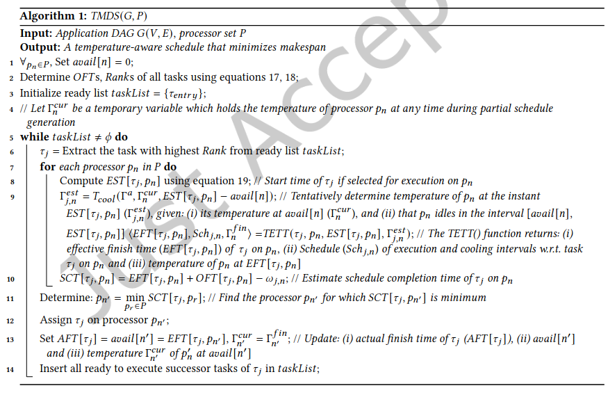
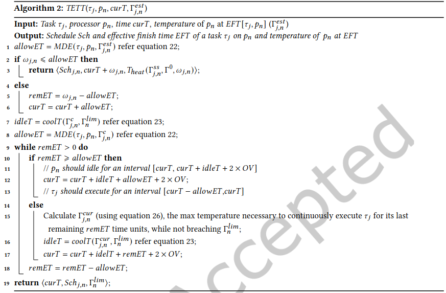
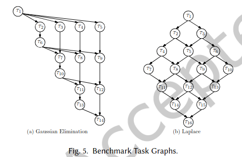
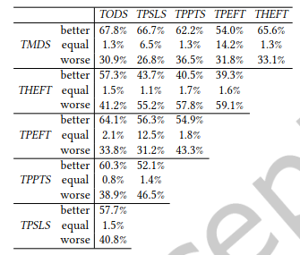

# گزارش فاز اول پروژه درس طراحی مدار‌های دیجیتال کم‌توان

مهدی بهرامیان - ۴۰۱۱۷۱۵۹۳

عنوان مقاله :
TMDS:Temperature aware Makespan Minimizing DAG Scheduler for Heterogeneous Distributed Systems

این مقاله یک الگوریتم زمانبندی مبتنی بر گراف تسک و با توجه به دما، روی پردازنده های ناهمگن ارائه میدهد.
نکته تمایز این تحقیق از مقالات دیگر یکی همین ناهمگن بودن پردازنده هاست و دیگری توجه به
دما و ویژگی های حرارتی پردازنده علاوه بر اهمیت زمان بر وظایف بیدرنگ است.

این مقاله با تعریف نحوه مدلسازی مساله شروع میکند :

- pow_t :
  توان مصرفی زمان t
- pow_d :
  توان مصرفی پویا زمان t
- pow_s :
  توان مصرفی ایستا زمان t
- pow_t = pow_d + pow_s = C0 f^3 + (C1 f + C2 f T_t)
- A = a(C0 f^3 + C1 f) , B = (b - aC2 f)
- T_q = A/B + (T0 - A/B)e^(-B(q-0)) : رابطه دما وقتی وظیفه بر روی پردازنده درحال اجراست

سپس هدف این بهینه سازی به صورت کمینه کردن طول زمان کل این زمانبندی به طوری که
شرایط حرارتی حفظ شود تعریف می‌شود.

راهی که این مقاله برای این مساله ارائه میدهد به صورت ترکیب ۲ تابع
TMDS(G, P) و TETT(t, p, temp, T_est[t,p])
است که اولی الگوریتم اصلی زمانبندی و دومی یک الگوریتم کمکی برای
بررسی نتیجه زمانبندی وظیفه t روی پردازنده p در دمای temp است.

این دو الگوریتم را در زیر مشاهده میکنید :‌

در نهایت برای آزمون الگوریتم خود، این زمانبندی را روی دو الگوریتم
Gaussian Elimination
و
Laplace
آزموده اند که گراف وظایفشان به شکل زیر است :

و نتایج آزمایششان در مقابل مقالات گذشته THEFT, TPEFT, TPPTS و TPSL به صورت زیر است :

